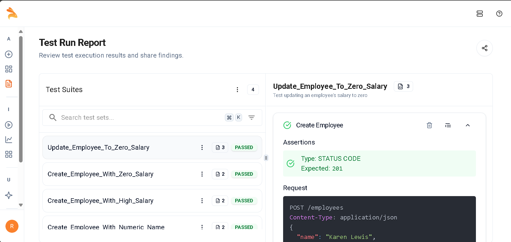
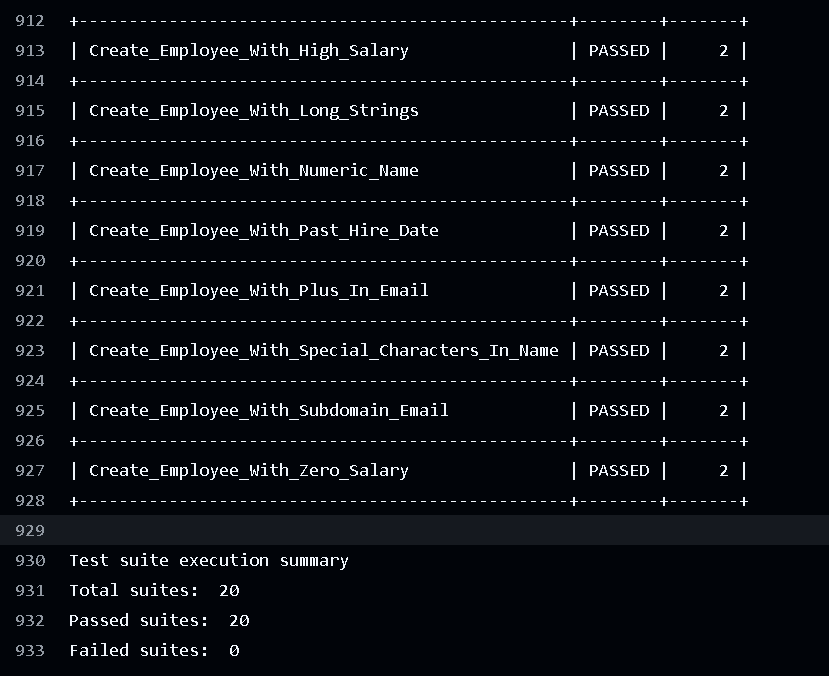

# Employee Management System

## 🌐 Live Demo
**[View Live Application](https://keploy-assignment-2.vercel.app/)**

## 📖 Project Overview
A full-stack Employee Management System with CRUD functionality, featuring **AI-powered API testing using Keploy** and **automated CI/CD integration**.

## 🛠️ Tech Stack
- **Frontend:** React.js, Axios, CSS3, Vercel
- **Backend:** FastAPI, MongoDB, PyMongo, Render
- **Testing:** pytest, Keploy, GitHub Actions
- **CI/CD:** GitHub Actions, automated deployment

## 🤖 AI-Powered API Testing with Keploy

### Implementation
- **Automated Test Generation** - AI creates comprehensive test cases
- **Intelligent Mock Data** - Realistic employee data scenarios
- **Complete API Coverage** - All CRUD operations tested

### OpenAPI Schema
FastAPI auto-generates OpenAPI documentation for schema-driven testing and validation.

## 🔄 CI/CD Integration
Automated GitHub Actions pipeline configured in [`.github/workflows/main.yml`](.github/workflows/main.yml):
- Runs pytest and Keploy test suites
- Multi-environment testing
- Automated deployment on successful tests

## ✅ Test Results

### Keploy Dashboard


**Results:** 20/20 test suites passed ✅

### GitHub Actions Console


**Status:** All workflows passing ✅

### Pytest Coverage Report


**Coverage:** 88% code coverage ✅

## 🚀 API Endpoints
| Method | Endpoint | Description |
|--------|----------|-------------|
| GET | `/` | API health check |
| POST | `/employees` | Create employee |
| GET | `/employees` | Get all employees |
| GET | `/employees/{id}` | Get employee by ID |
| PUT | `/employees/{id}` | Update employee |
| DELETE | `/employees/{id}` | Delete employee |

## 🏃‍♂️ Quick Start

### Backend
```bash
cd Backend
pip install -r requirements.txt
python main.py
```

### Frontend
```bash
cd Frontend
npm install
npm start
```

### Run Tests
```bash
# Traditional tests
pytest

# Keploy tests (if CLI installed)
keploy test
```

## 📊 Test Coverage
- **88% code coverage** with pytest
- **20 AI-generated test suites** with Keploy
- **100% success rate** in latest test run

## 📁 Project Structure
```
employee-management-system/
├── .github/workflows/main.yml    # CI/CD configuration
├── Frontend/
│   ├── src/
│   │   ├── App.js                # Main React component
│   │   ├── App.css               # Styles
│   │   └── index.js              # Entry point
│   └── package.json
├── Backend/
│   ├── main.py                   # FastAPI application
│   ├── models.py                 # Data models
│   ├── database.py               # MongoDB connection
│   ├── requirements.txt          # Dependencies
│   └── tests/                    # Test files
│       ├── test_api.py
│       ├── test_integration.py
│       └── test_unit.py
├── screenshots/                  # Documentation images
│   ├── keploy-test-report.png
│   └── github-actions-console.png
└── README.md
```

## ⚠️ Note
Backend hosted on Render free tier - first request may take 1-2 minutes.

## 📧 Contact
**Roshan Kumar Singh**  
📧 roshan.kr.singh9857@gmail.com  
🔗 [LinkedIn](https://www.linkedin.com/in/roshan-kumar-singh-60b68a253/) | [Portfolio](https://roshansingh.live) | [GitHub](https://github.com/Roshansingh9/Keploy_Assignment-2)

---
**🚀 Experience AI-powered testing with Keploy integration!**
